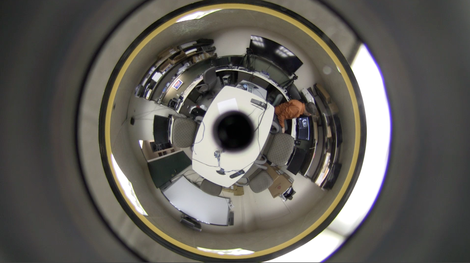
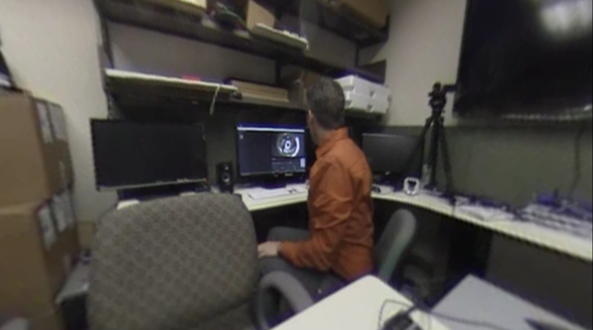

equiangular-unwarp
==================

Browser-based unwarping of a canned or real-time video image obtained from a panoramic equiangular mirror like the [GoPano Plus](http://www.gopano.com/products/gopano-plus).

Overview
========

An equiangular panoramic mirror is a component of a [catadioptric](http://en.wikipedia.org/wiki/Catadioptric_system) panoramic camera. An equiangular panoramic mirror is a class of [hyperboloid](http://en.wikipedia.org/wiki/Hyperboloid) mirrors with the property that [preserves a linear relationship](http://www.ncbi.nlm.nih.gov/pubmed/18264368) between the angle of incidence of light on the mirror surface and the angle of reflection onto the camera focal plane. This relationship simplifies unwarping the captured image, making it possible to unwarp real-time HD video in a web browser, as this code demonstrates.

The approach here relies on two emerging HTML5 standards: [WebRTC](http://www.webrtc.org) and [WebGL](http://www.khronos.org/webgl/). WebRTC supports real-time browser-based video and audio capture from a local or remote device. WebGL provides browser-based access to a dedicated graphics processor supporting high-speed graphics processing. [The code](lib/equiangular-unwarp.js) utilizes the [three.js](http://threejs.org) library to simplify mapping the warped image to a sphere and extracting a [gnomonic projection](http://en.wikipedia.org/wiki/Gnomonic_projection) from the sphere.

Download
========

Visit the [releases page](https://github.com/gwbond/equiangular-unwarp/releases) to download the latest release.

Usage
=====

See [index.html](index.html) for an example of using the code. Using the default settings the code will display a static movie file included with this distribution. See [the comments](index.html#L30-42) in the code for how to reconfigure the example to display a live video stream from a local video device or a remote WebRTC video source.

**This example must be installed on a webserver to work.** Use Google Chrome v26 or greater to access the example.

